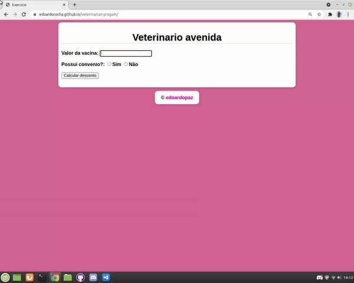

<h1 align="center"> game-which-watermelon </h1>
 
 
 
 
 
 
 

 
 
 > status: Updates coming soon ⏸️
 
 
 
 ## How to use this algorithm?

1. Add query value
     + Add the query value in the text bar
2. Do you have an agreement or not?
     + Agr select if you have an agreement or not if you select "Yes" will open a select to choose the type of agreement
3. calculate the value
     + Calculate your discount on the veterinary program

## What does this algorithm consist of?

This algorithm is to help stores that need a "Discounter" to calculate the discount of their queries or even more things. To be continued... 👀

## Technologies used

<table> 
 <tr>
  <td>JavaScript</td>
  <td>HTML</td>
  <td>CSS</td>
 </tr>
 <tr> 
  <td> ECMAS v8.0</td>
  <td> v5.0 </td>
  <td>v3.0</td>
 </tr>
</table>

## License
Repository covered by [MIT](http://escolhaumalicenca.com.br/licencas/mit/) license
